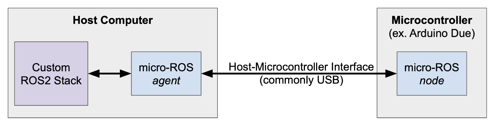

# 1. MicroROS
The following content is borrowed from [here](https://roboticsknowledgebase.com/wiki/interfacing/microros-for-ros2-on-microcontrollers/#installation-overview). For more information on microROS, checkout [micro-ros official website](https://micro.ros.org/docs/tutorials/programming_rcl_rclc/overview/).

## 1.1. Introduction
* Micro-ROS node/application: A ros node that runs in microcontroller (Micro-ROS Client libraries- specific to the microcontroller hardware- used to develop micro-ROS application/node)
* Micro-ROS agent runs on your host laptop - allows communication between micro-ROS node and ROS2 stack (i.e. other ros nodes running in your laptop). It enables micro-ROS node to publish and subscribe like any other ROS node.



## 1.2. Installation:
This document assumes you have ROS2 and docker installed on your host machine/laptop. If ROS2 is not installed, please follow the ROS2 installation guide for official instructions (debian packages). Once you have a ROS 2 installation in the computer, follow these steps to install the micro-ROS build system:

```bash
# In a new terminal:
cd ~/ros2_ws/src/TRAILBot/Arduino
chmod +x *.sh
./setup_microros_agent.sh
```

## 1.3. Setting up MicroROS with Arduino Due

1. First, it is necessary to have the Arduino IDE installed, with the Board Manager configured for use with the Arduino Due board. You can confirm this setup by referencing the [Arduino Due Quickstart Guide](https://docs.arduino.cc/hardware/due). Open Arduino IDE, go to the Boards Manager and install `Arduino SAM Boards (32 bits ARM cortex-M3)`.
2. Run the following in a new terminal:

```bash
cd ~/ros2_ws/src/TRAILBot/Arduino
./setup_microros_arduinodue.sh
```

## 1.4. Testing the Installation

1. `setup_microros_arduinodue.sh` builds micro_ros_arduino library again with our trailbot_interfaces package. If build was successful, you should be able to find `trailbot_interfaces/RunServo.srv` in ` ~/Arduino/libraries/micro_ros_arduino-2.0.5-humble/available_ros2_types` 
 
2. First, we will test the installation of the precompiled micro-ROS libraries for the microcontroller. Open the Arduino IDE and navigate to `File -> Examples -> micro_ros_arduino -> micro-ros_publisher` to open up an example sketch. Verify that it compiles. Connect your microcontroller to your computer and upload the sketch. If the installation was properly completed, this should compile and upload successfully.

3. Next, we can initiate the micro-ROS agent to verify installation of the micro-ROS libraries onto the host computer. First check the device name by running `ls /dev`. It will typically be named something like `/dev/ttyACM0` (though if you are not sure, you can always run `ls /dev` before and after plugging in the Arduino to determine what device has changed). 
   
    Assuming a device name of `/dev/ttyACM0`, the micro-ROS agent can be initiated by running: 
    ```bash
    # In a new terminal:
    cd ~/ros2_ws/src/TRAILBot/Arduino
    ./run_microros_agent.sh
    ```

    The `-v6` parameter is simply for observing debug output, but can be omitted if desired. 
        
    The micro-ROS agent facilitates the serial communication between the host machine and the microcontroller running micro-ROS; if the agent is successful in communicating with the microcontroller, you should see several `send_message` and `recv_message` debug messages printed to the console. If you don't see this, try hitting the reset button on the Arduino.

    Run `ros2 topic list`. You should be able to see the topic `/micro_ros_arduino_node_publisher`. Echo the topic and verify that data is being received from the microcontroller. If you've gotten this far, that means the installation was successful. Congratulations!

    **NOTE:** One caveat is that if the `micro_ros_agent` is killed and restarted, the host machine may stop receiving messages even if the micro-ROS application is still running on the microcontroller. If this occurs, you may need to reset/power cycle the microcontroller for those messages to begin being received again. Work-arounds for this are discussed in [Advanced: Heartbeat for Transient Connectivity](#advanced-heartbeat-for-transient-connectivity).
